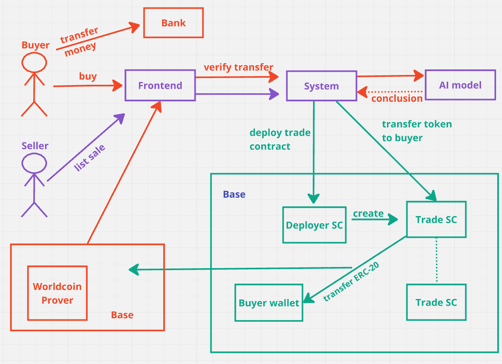

# NexTrade

NexTrade is a decentralized peer-to-peer coin transfer platform that enables users to buy and sell digital tokens. The platform allows for transactions to be conducted via wallets or through bank transfers. NexTrade prioritizes security and user verification through Worldcoin to maintain a safe marketplace, free from bot interactions.

## Features

- **Peer-to-Peer Transactions**: Users can directly buy and sell tokens with each other using either wallet-to-wallet transfers or bank transfers.
- **Worldcoin Verification**: All users are verified via Worldcoin before they can access the marketplace, preventing bot interactions and ensuring a secure environment.
- **Flexible Payment Options**: 
  - Sellers can receive payment directly to their wallet or through a bank transfer.
  - Buyers can pay using their wallet or by making a bank transfer.
- **AI-Powered Bank Transfer Verification**: 
  - For transactions involving bank transfers, NexTrade employs an AI model to verify the details of the transaction.
  - The AI extracts the IBAN, amount, and currency from the invoice and compares them to the details provided by the user.
  - Upon successful verification, an attestation report is generated, which is stored on-chain, allowing users to attest to the validity of their transactions.
- **Deployment**: All smart contracts are deployed on the Base-Sepolia chain.

## How It Works

1. **User Verification**: 
   - New users sign up and are verified via Worldcoin. 
   - Only verified users can access the NexTrade marketplace.

2. **Listing Tokens**: 
   - Sellers list the tokens they wish to sell, specifying the desired payment method (wallet or bank transfer).
   - Buyers list the tokens they wish to purchase and select their preferred payment method.

3. **Transaction Process**: 
   - **Wallet-to-Wallet**: Transactions are completed directly between users' wallets.
   - **Bank Transfer**: 
     - The buyer makes a bank transfer, and NexTrade's AI model verifies the transaction by extracting details from the invoice and comparing them to which the user specified.
     - If the details match, an attestation report is created and stored on-chain.

4. **Attestation Report**: 
   - After verification, an attestation report is generated and linked to the bank transaction, providing proof of the transaction on the blockchain.

## Getting Started

To start using NexTrade:

`npm run dev` inside platform folder.

## Flow

## Deployed Contract Addresses on Base Sepolia and Attestation Links

- WorldCoinVerifier: `0x8749F80ae877A0630a6F85Dd67f8468BBd1369ff`
- Attestation Schema: `https://base-sepolia.easscan.org/schema/view/0xeca168efa37281d63315562fecb4af364354d524e7bbe71007d35134dcd9ac3a`
- Trade Market `0x19645f6aBA4D66B48067ddAA1785bb67CAD50016`
- Examle Trade Contract `0xA0aEb3cD1967d2BABFb418f422FbBd5941E4426c`

## License

NexTrade is licensed under the MIT License.

